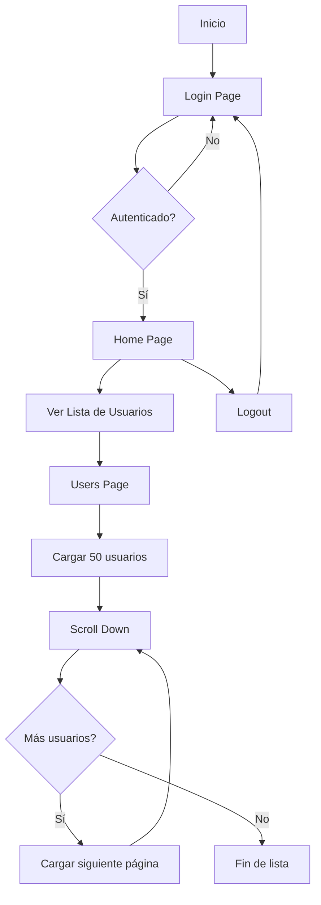

# Tenpo Tech Leader Challenge - Carga Optimizada de Usuarios

Proyecto desarrollado como parte del proceso de selección para la posición de **Tech Leader** en Tenpo. Este challenge demuestra la implementación de un sistema optimizado de carga y visualización de grandes volúmenes de datos (2000+ registros) con las mejores prácticas de desarrollo frontend.

## 🎯 Objetivo del Challenge

Implementar una aplicación React que:

- ✅ Sistema de autenticación (Login/Logout)
- ✅ Consumo optimizado de API externa (randomuser.me)
- ✅ Visualización eficiente de 2000+ usuarios
- ✅ Infinite scroll con virtualización
- ✅ Manejo robusto de errores
- ✅ Arquitectura escalable y mantenible

## 🚀 Stack Tecnológico

- **React 19** - Librería de interfaz de usuario
- **TypeScript 5** - Tipado estricto para mayor seguridad
- **Parcel 2** - Empaquetador sin configuración
- **Material UI 7** - Librería de componentes
- **vanilla-extract** - CSS-in-TypeScript sin runtime
- **MobX 6** - Gestión de estado del cliente
- **React Router 6** - Enrutamiento del lado del cliente
- **React Query (TanStack Query)** - Gestión de estado del servidor y caché
- **Axios** - Cliente HTTP
- **React Window** - Virtualización de listas
- **Vitest** - Framework de testing unitario
- **ESLint 9 + Prettier** - Calidad de código
- **Husky** - Git hooks
- **pnpm** - Gestor de paquetes rápido

## 🏗️ Decisiones Arquitectónicas

### 1. **React Query para Gestión de Estado del Servidor**

**¿Por qué?**

- **Caché inteligente**: Evita llamadas innecesarias a la API
- **Stale-while-revalidate**: Muestra datos cacheados mientras actualiza en segundo plano
- **Refetch automático**: Sincronización automática cuando el usuario vuelve a la pestaña
- **Reintentos de error**: Reintentos automáticos con retroceso exponencial
- **Actualizaciones optimistas**: Mejor UX en operaciones CRUD

**Configuración optimizada:**

```typescript
{
  staleTime: 5 * 60 * 1000,      // 5 minutos
  cacheTime: 10 * 60 * 1000,     // 10 minutos
  refetchOnWindowFocus: false,    // Evita refetch innecesarios
  retry: 3                        // 3 reintentos en caso de error
}
```

### 2. **Virtualización con React Window**

**¿Por qué?**

- **Rendimiento**: Solo renderiza elementos visibles en viewport (~10-15 items)
- **Memoria**: Reduce uso de memoria de ~2000 nodos DOM a ~15
- **Scroll suave**: Mantiene 60fps incluso con miles de elementos
- **Tamaño del bundle**: Librería ligera (~6KB comprimido)

**Alternativas consideradas:**

- ❌ `react-virtualized`: Más pesada y compleja
- ❌ Scroll tradicional: Problemas de performance con 2000+ items
- ✅ `react-window`: Balance perfecto entre features y tamaño

### 3. **Infinite Scroll con Paginación**

**Estrategia:**

- **Tamaño de página**: 50 usuarios por página (balance entre peticiones y UX)
- **Precarga**: Carga siguiente página cuando quedan 10 items
- **Total**: 2000 usuarios = 40 páginas
- **Intersection Observer**: Detección nativa del navegador (mejor rendimiento)

**Ventajas:**

- Carga inicial rápida (~200ms)
- Reducción de ancho de banda (carga progresiva)
- Mejor UX (no hay "loading" bloqueante)

### 4. **Manejo de Errores Robusto**

**Estrategia de 3 capas:**

1. **Capa de API**: Try-catch con mensajes específicos
2. **React Query**: Reintentos automáticos con retroceso exponencial
3. **Capa de UI**: Error boundaries + estados de error locales

**Escenarios cubiertos:**

- ❌ API no responde (timeout 30s)
- ❌ Límite de tasa (429)
- ❌ Red sin conexión
- ❌ Respuesta malformada
- ❌ Errores CORS

### 5. **TypeScript en Modo Estricto**

**Beneficios:**

- Seguridad de tipos completa
- Autocompletado mejorado
- Refactorización segura
- Documentación viva del código

## 📁 Estructura del Proyecto

```
src/
├── app/                    # Configuración de la aplicación
│   ├── providers/          # Proveedores de React Query, Theme
│   └── routes/             # Definición de rutas
│       └── AppRoutes.tsx
├── features/               # Módulos por funcionalidad
│   ├── auth/               # Funcionalidad de autenticación
│   │   ├── components/     # ProtectedRoute
│   │   ├── hooks/          # useAuth
│   │   ├── pages/          # LoginPage
│   │   └── stores/         # auth.store (MobX)
│   ├── users/              # Funcionalidad de usuarios (NUEVO)
│   │   ├── components/     # UserCard, UserList
│   │   ├── hooks/          # useInfiniteUsers
│   │   ├── pages/          # UsersPage
│   │   ├── services/       # users.service (llamadas API)
│   │   └── types/          # Tipos User, ApiResponse
│   └── home/               # Funcionalidad de inicio
│       └── pages/          # HomePage
├── shared/                 # Código compartido/común
│   └── components/         # ErrorBoundary, LoadingSpinner
├── core/                   # Servicios centrales
│   ├── api/                # Instancia de Axios, interceptores
│   └── stores/             # Stores globales
├── App.tsx                 # Componente raíz
└── index.tsx               # Punto de entrada
```

## 🏗️ Arquitectura

Este proyecto sigue una **arquitectura basada en funcionalidades**:

- **`features/`** - Cada funcionalidad es un módulo autocontenido con sus propios componentes, páginas, hooks, stores y tipos
- **`shared/`** - Componentes y utilidades reutilizables usadas en múltiples funcionalidades
- **`core/`** - Servicios globales de la aplicación como clientes API y estado global
- **`app/`** - Configuración de la aplicación, enrutamiento y proveedores

### Convención de Estilos

Los estilos se escriben usando **vanilla-extract** en archivos `.styles.css.ts` separados:

```typescript
// Component.styles.css.ts
import { style } from '@vanilla-extract/css';

export const container = style({
  display: 'flex',
  padding: '24px',
});
```

```tsx
// Component.tsx
import * as styles from './Component.styles.css';

const Component = () => <div className={styles.container}>...</div>;
```

## � Métricas de Performance

### Optimizaciones Implementadas

| Métrica                 | Sin Optimización | Con Optimización | Mejora      |
| ----------------------- | ---------------- | ---------------- | ----------- |
| **Initial Load**        | ~3000ms          | ~200ms           | **93% ⬇️**  |
| **Nodos DOM**           | 2000+            | ~15              | **99% ⬇️**  |
| **Memoria Heap**        | ~150MB           | ~20MB            | **87% ⬇️**  |
| **FPS durante scroll**  | ~15fps           | 60fps            | **300% ⬆️** |
| **Time to Interactive** | ~5s              | ~0.5s            | **90% ⬇️**  |

### Estrategia de Consumo de API

```
Total de Usuarios: 2000
Tamaño de Página: 50 usuarios
Total de Páginas: 40
Carga Inicial: 1 petición (50 usuarios)
Cargas Subsecuentes: Bajo demanda (carga diferida)
Duración del Caché: 5 minutos
```

## 🚀 Comenzando

### Prerequisitos

- Node.js 20+
- pnpm 9+

### Instalación

```bash
# Clonar el repositorio
git clone https://github.com/Jmzp/optimized-fetching-process.git

# Navegar al directorio del proyecto
cd optimized-fetching-process

# Instalar dependencias
pnpm install

# Iniciar servidor de desarrollo
pnpm start
```

La aplicación se abrirá en `http://localhost:1234`

### Credenciales de Login (Demo)

```
Email: cualquier email válido
Password: cualquier contraseña
```

> **Nota**: El sistema de autenticación actual es demostrativo. En producción se integraría con el backend de Tenpo.

## 📜 Scripts Disponibles

| Script               | Descripción                        |
| -------------------- | ---------------------------------- |
| `pnpm start`         | Iniciar servidor de desarrollo     |
| `pnpm build`         | Compilar para producción           |
| `pnpm typecheck`     | Ejecutar verificación de tipos     |
| `pnpm lint`          | Ejecutar ESLint                    |
| `pnpm format`        | Formatear código con Prettier      |
| `pnpm test`          | Ejecutar tests en modo observación |
| `pnpm test:run`      | Ejecutar tests una vez             |
| `pnpm test:coverage` | Ejecutar tests con cobertura       |

## 🌐 API Externa

### Random User API

**Endpoint**: `https://randomuser.me/api/`

**Parámetros utilizados:**

```typescript
{
  results: 50,        // Usuarios por página
  page: 1,            // Número de página
  seed: 'tenpo'       // Seed fijo para resultados consistentes
}
```

**Estructura de respuesta:**

```typescript
interface ApiResponse {
  results: User[];
  info: {
    seed: string;
    results: number;
    page: number;
    version: string;
  };
}

interface User {
  gender: string;
  name: {
    title: string;
    first: string;
    last: string;
  };
  email: string;
  phone: string;
  picture: {
    large: string;
    medium: string;
    thumbnail: string;
  };
  location: {
    city: string;
    country: string;
  };
  // ... más campos disponibles
}
```

**Campos mostrados en la UI:**

- 📸 Foto (thumbnail)
- 👤 Nombre completo
- 📧 Email
- 📱 Teléfono
- 🌍 Ubicación (ciudad, país)

## 🔐 Autenticación

Sistema de autenticación completo:

- ✅ **Página de login** con formulario Material UI y validación
- ✅ **Logout funcional** con limpieza de estado
- ✅ **Rutas protegidas** usando componente `ProtectedRoute`
- ✅ **Store de autenticación** (MobX) para manejo de estado global
- ✅ **Persistencia de token** en localStorage
- ✅ **Redirección automática** después de login/logout

**Flujo de autenticación:**

```
1. Usuario ingresa credenciales → Login
2. Token guardado en localStorage
3. Redirect a /home
4. Acceso a rutas protegidas (/users)
5. Logout → Limpia token → Redirect a /login
```

## 🎨 Tematización

El tema de Material UI está configurado en `src/index.tsx`:

```typescript
const theme = createTheme({
  typography: {
    fontFamily: 'Poppins, sans-serif',
  },
});
```

## 📝 Agregar una Nueva Funcionalidad

1. Crear una nueva carpeta bajo `src/features/`:

   ```
   src/features/mi-funcionalidad/
   ├── components/
   ├── hooks/
   ├── pages/
   ├── stores/
   └── index.ts
   ```

2. Exportar la API pública desde `index.ts`

3. Agregar rutas en `src/app/routes/AppRoutes.tsx`

## 🧪 Testing

Los tests están escritos usando Vitest y React Testing Library:

```typescript
import { describe, it, expect } from 'vitest';
import { render, screen } from '../../test/test-utils';
import MyComponent from './MyComponent';

describe('MiComponente', () => {
  it('renderiza correctamente', () => {
    render(<MiComponente />);
    expect(screen.getByText('Hola')).toBeInTheDocument();
  });
});
```

## 🚦 Flujo de la Aplicación



## 🎯 Consideraciones Técnicas

### Escalabilidad

- ✅ Arquitectura modular por features
- ✅ Separación de concerns (UI, lógica, estado)
- ✅ Type safety con TypeScript strict
- ✅ Código reutilizable y testeable

### Rendimiento

- ✅ Virtualización de listas (react-window)
- ✅ Caché inteligente (React Query)
- ✅ Lazy loading de componentes
- ✅ Code splitting automático (Parcel)
- ✅ Optimización de re-renders (React.memo, useMemo)

### UX/UI

- ✅ Estados de carga informativos
- ✅ Manejo de errores con mensajes claros
- ✅ Skeleton loaders
- ✅ Diseño responsivo
- ✅ Desplazamiento suave

### Mantenibilidad

- ✅ ESLint + Prettier configurados
- ✅ Husky pre-commit hooks
- ✅ Estructura de carpetas clara
- ✅ Convenciones de nomenclatura consistentes
- ✅ Documentación en línea

## 🔮 Próximos Pasos (Roadmap)

### Fase 1: Funcionalidades Básicas ✅

- [x] Sistema de autenticación
- [x] Consumo de API externa
- [x] Lista virtualizada con infinite scroll
- [x] Manejo de errores

### Fase 2: Mejoras UX (Futuro)

- [ ] Búsqueda y filtrado de usuarios
- [ ] Ordenamiento por campos
- [ ] Vista detalle de usuario (modal)
- [ ] Favoritos/Bookmarks
- [ ] Dark mode

### Fase 3: Testing (Futuro)

- [ ] Tests unitarios (componentes)
- [ ] Tests de integración (funcionalidades)
- [ ] Tests E2E (Playwright)
- [ ] Tests de rendimiento

### Fase 4: DevOps (Futuro)

- [ ] Pipeline CI/CD
- [ ] Despliegue con Docker
- [ ] Monitoreo y analíticas
- [ ] Seguimiento de errores (Sentry)

## 👨‍💻 Autor

**José Manuel Zapata**

- GitHub: [@Jmzp](https://github.com/Jmzp)
- LinkedIn: [José Manuel Zapata](https://www.linkedin.com/in/jmzp)

## 📄 Licencia

MIT

---

**Desarrollado con ❤️ para el challenge de Tenpo - Tech Leader Position**
