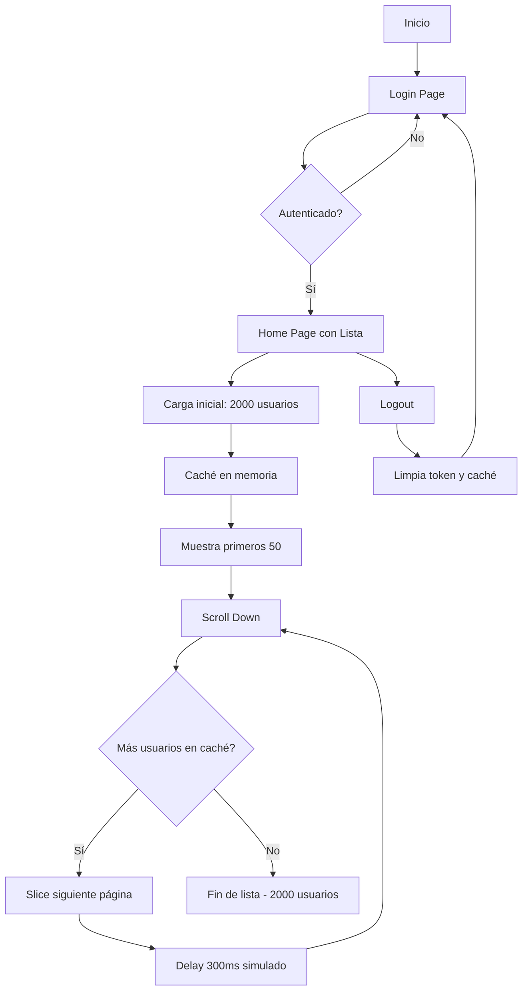

# Tenpo Tech Leader Challenge - Carga Optimizada de Usuarios

Proyecto desarrollado como parte del proceso de selección para la posición de **Tech Leader** en Tenpo. Este challenge demuestra la implementación de un sistema optimizado de carga y visualización de grandes volúmenes de datos (2000+ registros) con las mejores prácticas de desarrollo frontend.

## 🎯 Objetivo del Challenge

Implementar una aplicación React que:

- ✅ Sistema de autenticación (Login/Logout)
- ✅ Consumo optimizado de API externa (randomuser.me)
- ✅ Visualización eficiente de 2000+ usuarios
- ✅ Infinite scroll con virtualización
- ✅ Manejo robusto de errores
- ✅ Arquitectura escalable y mantenible

## 🚀 Stack Tecnológico

- **React 19** - Librería de interfaz de usuario
- **TypeScript 5** - Tipado estricto para mayor seguridad
- **Parcel 2** - Empaquetador sin configuración
- **Material UI 7** - Librería de componentes
- **vanilla-extract** - CSS-in-TypeScript sin runtime
- **MobX 6** - Gestión de estado del cliente
- **React Router 6** - Enrutamiento del lado del cliente
- **React Query (TanStack Query)** - Gestión de estado del servidor y caché
- **Axios** - Cliente HTTP
- **React Window** - Virtualización de listas
- **Vitest** - Framework de testing unitario
- **ESLint 9 + Prettier** - Calidad de código
- **Husky** - Git hooks
- **pnpm** - Gestor de paquetes rápido

## 🏗️ Decisiones Arquitectónicas

### 1. **React Query para Gestión de Estado del Servidor**

**¿Por qué?**

- **Caché inteligente**: Evita llamadas innecesarias a la API
- **Stale-while-revalidate**: Muestra datos cacheados mientras actualiza en segundo plano
- **Refetch automático**: Sincronización automática cuando el usuario vuelve a la pestaña
- **Reintentos de error**: Reintentos automáticos con retroceso exponencial
- **Actualizaciones optimistas**: Mejor UX en operaciones CRUD

**Configuración optimizada:**

```typescript
{
  staleTime: 5 * 60 * 1000,      // 5 minutos
  cacheTime: 10 * 60 * 1000,     // 10 minutos
  refetchOnWindowFocus: false,    // Evita refetch innecesarios
  retry: 3                        // 3 reintentos en caso de error
}
```

### 2. **Virtualización con React Window**

**¿Por qué?**

- **Rendimiento**: Solo renderiza elementos visibles en viewport (~10-15 items)
- **Memoria**: Reduce uso de memoria de ~2000 nodos DOM a ~15
- **Scroll suave**: Mantiene 60fps incluso con miles de elementos
- **Tamaño del bundle**: Librería ligera (~6KB comprimido)

**Alternativas consideradas:**

- ❌ `react-virtualized`: Más pesada y compleja
- ❌ Scroll tradicional: Problemas de performance con 2000+ items
- ✅ `react-window`: Balance perfecto entre features y tamaño

### 3. **Cliente HTTP Centralizado (Axios)**

**Arquitectura:**

Cliente HTTP robusto implementado en `src/core/api/httpClient.ts` con patrón Singleton:

```typescript
class HttpClient {
  private client: AxiosInstance;

  // Request interceptor - Agrega token automáticamente
  // Response interceptor - Manejo centralizado de errores
  // Métodos: get, post, put, patch, delete
}
```

**Características:**

- ✅ **Interceptores de Request**: Agrega Bearer token automáticamente
- ✅ **Interceptores de Response**: Manejo centralizado de errores HTTP
- ✅ **Gestión de tokens**: `setToken()`, `clearToken()`, `getStoredToken()`
- ✅ **Timeout configurable**: 30 segundos por defecto
- ✅ **Manejo de status codes**: 401 (limpia token), 403, 404, 429, 5xx
- ✅ **Mensajes en inglés**: Errores localizados y consistentes
- ✅ **Type-safe**: Tipado completo con `ApiResponse<T>` y `ApiError`

### 4. **Estrategia de Caché Optimizada**

**Implementación:**

En lugar de hacer 40 peticiones (2000 usuarios / 50 por página), el sistema:

1. **Descarga una vez**: Obtiene los 2000 usuarios en una sola petición inicial
2. **Caché en memoria**: Almacena los datos en una variable local del servicio
3. **Paginación virtual**: Simula paginación cortando el array cacheado
4. **Delay simulado**: 300ms para mantener UX realista

```typescript
let cachedData: CachedData | null = null;

if (!cachedData) {
  const response = await httpClient.get<CachedData>(URL_DATA);
  cachedData = response.data;
}

const paginatedResults = cachedData.results.slice(startIndex, endIndex);
```

**Ventajas:**

- ⚡ **1 petición vs 40**: Reduce llamadas a la API en 97.5%
- 🚀 **Carga instantánea**: Páginas subsecuentes son inmediatas
- 💾 **Menor uso de red**: ~500KB una vez vs múltiples peticiones
- 🎯 **UX superior**: Sin esperas entre páginas

### 5. **Infinite Scroll con Virtualización**

**Estrategia:**

- **Tamaño de página virtual**: 50 usuarios por "página"
- **Intersection Observer**: Detección cuando llegas al final de la lista
- **React Window**: Solo renderiza ~10-15 items visibles
- **Indicador flotante**: Loading toast que no afecta el scroll

**Ventajas:**

- Scroll suave a 60fps
- Sin saltos ni reflows
- Memoria constante (~15 nodos DOM)

### 6. **Manejo de Errores Robusto**

**Estrategia de 3 capas:**

1. **Capa de API**: Try-catch con mensajes específicos
2. **React Query**: Reintentos automáticos con retroceso exponencial
3. **Capa de UI**: Error boundaries + estados de error locales

**Escenarios cubiertos:**

- ❌ API no responde (timeout 30s)
- ❌ Límite de tasa (429)
- ❌ Red sin conexión
- ❌ Respuesta malformada
- ❌ Errores CORS

### 7. **TypeScript en Modo Estricto**

**Beneficios:**

- Seguridad de tipos completa
- Autocompletado mejorado
- Refactorización segura
- Documentación viva del código

## 📁 Estructura del Proyecto

```
src/
├── app/                    # Configuración de la aplicación
│   ├── providers/          # Proveedores de React Query, Theme
│   └── routes/             # Definición de rutas
│       └── AppRoutes.tsx
├── features/               # Módulos por funcionalidad
│   ├── auth/               # Funcionalidad de autenticación
│   │   ├── components/     # ProtectedRoute
│   │   ├── hooks/          # useAuth
│   │   ├── pages/          # LoginPage
│   │   └── stores/         # auth.store (MobX)
│   ├── users/              # Funcionalidad de usuarios (NUEVO)
│   │   ├── components/     # UserCard, UserList
│   │   ├── hooks/          # useInfiniteUsers
│   │   ├── pages/          # UsersPage
│   │   ├── services/       # users.service (llamadas API)
│   │   └── types/          # Tipos User, ApiResponse
│   └── home/               # Funcionalidad de inicio
│       └── pages/          # HomePage
├── shared/                 # Código compartido/común
│   └── components/         # ErrorBoundary, LoadingSpinner
├── core/                   # Servicios centrales
│   ├── api/                # Cliente HTTP centralizado
│   │   ├── types.ts        # ApiResponse, ApiError, HttpClientConfig
│   │   ├── httpClient.ts   # Singleton con interceptores
│   │   └── index.ts        # Exports públicos
│   └── stores/             # Stores globales (vacío - ver README.md interno)
├── App.tsx                 # Componente raíz
└── index.tsx               # Punto de entrada
```

## 🏗️ Arquitectura

Este proyecto sigue una **arquitectura basada en funcionalidades**:

- **`features/`** - Cada funcionalidad es un módulo autocontenido con sus propios componentes, páginas, hooks, stores y tipos
- **`shared/`** - Componentes y utilidades reutilizables usadas en múltiples funcionalidades
- **`core/`** - Servicios globales de la aplicación como clientes API y estado global
- **`app/`** - Configuración de la aplicación, enrutamiento y proveedores

### Convención de Estilos

Los estilos se escriben usando **vanilla-extract** en archivos `.styles.css.ts` separados:

```typescript
// Component.styles.css.ts
import { style } from '@vanilla-extract/css';

export const container = style({
  display: 'flex',
  padding: '24px',
});
```

```tsx
// Component.tsx
import * as styles from './Component.styles.css';

const Component = () => <div className={styles.container}>...</div>;
```

## 🚀 Comenzando

### Prerequisitos

- Node.js 20+
- pnpm 9+

### Instalación

```bash
# Clonar el repositorio
git clone https://github.com/Jmzp/optimized-fetching-process.git

# Navegar al directorio del proyecto
cd optimized-fetching-process

# Instalar dependencias
pnpm install

# Iniciar servidor de desarrollo
pnpm start
```

La aplicación se abrirá en `http://localhost:1234`

### Credenciales de Login (Demo)

```
Email: cualquier email válido
Password: cualquier contraseña
```

> **Nota**: El sistema de autenticación actual es demostrativo. En producción se integraría con el backend de Tenpo.

## 📜 Scripts Disponibles

| Script               | Descripción                        |
| -------------------- | ---------------------------------- |
| `pnpm start`         | Iniciar servidor de desarrollo     |
| `pnpm build`         | Compilar para producción           |
| `pnpm typecheck`     | Ejecutar verificación de tipos     |
| `pnpm lint`          | Ejecutar ESLint                    |
| `pnpm format`        | Formatear código con Prettier      |
| `pnpm test`          | Ejecutar tests en modo observación |
| `pnpm test:run`      | Ejecutar tests una vez             |
| `pnpm test:coverage` | Ejecutar tests con cobertura       |

## 🌐 API Externa

### Random User API

**Endpoint**: `https://randomuser.me/api/`

**Parámetros utilizados:**

```typescript
{
  results: 50,        // Usuarios por página
  page: 1,            // Número de página
  seed: 'tenpo'       // Seed fijo para resultados consistentes
}
```

**Estructura de respuesta:**

```typescript
interface ApiResponse {
  results: User[];
  info: {
    seed: string;
    results: number;
    page: number;
    version: string;
  };
}

interface User {
  gender: string;
  name: {
    title: string;
    first: string;
    last: string;
  };
  email: string;
  phone: string;
  picture: {
    large: string;
    medium: string;
    thumbnail: string;
  };
  location: {
    city: string;
    country: string;
  };
  // ... más campos disponibles
}
```

**Campos mostrados en la UI:**

- 📸 Foto (thumbnail)
- 👤 Nombre completo
- 📧 Email
- 📱 Teléfono
- 🌍 Ubicación (ciudad, país)

## 🔐 Autenticación

Sistema de autenticación completo:

- ✅ **Página de login** con formulario Material UI y validación
- ✅ **Logout funcional** con limpieza de estado
- ✅ **Rutas protegidas** (`ProtectedRoute`) y públicas (`PublicRoute`)
- ✅ **Store de autenticación** (MobX) para manejo de estado global
- ✅ **Persistencia de token** en localStorage
- ✅ **Redirección inteligente** basada en intento de navegación

**Flujo de autenticación y Rutas:**

1. **ProtectedRoute**:
   - Protege rutas privadas (ej. `/home`, `/profile`)
   - Si no hay sesión: Redirige a `/login` guardando la ubicación original
   - Si hay sesión: Permite el acceso

2. **PublicRoute**:
   - Maneja rutas de acceso público (ej. `/login`)
   - Si hay sesión: Redirige automáticamente a la ruta que intentaba visitar o `/home`
   - Si no hay sesión: Permite el acceso

3. **Login Flow**:
   - Usuario ingresa credenciales
   - Se guarda token y email en localStorage
   - Se redirige a la ruta original (guardada en state) o `/home`

**Integración con httpClient:**

El `authStore` se integra con el `httpClient` para gestión automática de tokens:

```typescript
// Al hacer login
localStorage.setItem(TOKEN_KEY, FAKE_TOKEN);
// httpClient detecta el token automáticamente en cada request

// Al hacer logout
localStorage.removeItem(TOKEN_KEY);
// httpClient limpia el token en interceptor 401
```

## 🎨 Tematización

El tema de Material UI está configurado en `src/index.tsx`:

```typescript
const theme = createTheme({
  typography: {
    fontFamily: 'Poppins, sans-serif',
  },
});
```

## 📝 Agregar una Nueva Funcionalidad

1. Crear una nueva carpeta bajo `src/features/`:

   ```
   src/features/mi-funcionalidad/
   ├── components/
   ├── hooks/
   ├── pages/
   ├── stores/
   └── index.ts
   ```

2. Exportar la API pública desde `index.ts`

3. Agregar rutas en `src/app/routes/AppRoutes.tsx`

## 🧪 Testing

Los tests están escritos usando Vitest y React Testing Library:

```typescript
import { describe, it, expect } from 'vitest';
import { render, screen } from '../../test/test-utils';
import MyComponent from './MyComponent';

describe('MiComponente', () => {
  it('renderiza correctamente', () => {
    render(<MiComponente />);
    expect(screen.getByText('Hola')).toBeInTheDocument();
  });
});
```

## 🚦 Flujo de la Aplicación



## � Diseño UI

### Layout Sin Scroll Global

La aplicación usa un layout de altura fija sin scroll global:

```
┌─────────────────────────────────────┐
│  🟢 Fondo Gradiente Verde (100vh)  │
│                                     │
│  ┌─────────────────────────────┐   │
│  │  Header (AppBar)            │   │
│  └─────────────────────────────┘   │
│                                     │
│  ┌─────────────────────────────┐   │
│  │ 🤍 Card Blanca (Redondeada) │   │
│  │                             │   │
│  │  Users Directory            │   │
│  │  ─────────────────────────  │   │
│  │                             │   │
│  │  [Lista con scroll interno] │   │
│  │  ↕️                          │   │
│  │                             │   │
│  └─────────────────────────────┘   │
└─────────────────────────────────────┘
```

**Características:**

- ✅ Sin scroll global (overflow: hidden en body)
- ✅ Card ocupa calc(100vh - 100px)
- ✅ Solo la lista tiene scroll interno
- ✅ Indicador de carga flotante (fixed position)
- ✅ Diseño limpio y moderno con gradiente verde

## � Consideraciones Técnicas

### Escalabilidad

- ✅ Arquitectura modular por features
- ✅ Separación de concerns (UI, lógica, estado)
- ✅ Type safety con TypeScript strict
- ✅ Código reutilizable y testeable

### Rendimiento

- ✅ **Virtualización de listas** (react-window) - Solo 10-15 nodos DOM
- ✅ **Caché en memoria** - 1 petición para 2000 usuarios
- ✅ **Paginación virtual** - Slice de array sin peticiones HTTP
- ✅ **Lazy loading** de componentes
- ✅ **Code splitting** automático (Parcel)
- ✅ **Optimización de re-renders** (observer de MobX)
- ✅ **Layout optimizado** - Sin scroll global, altura fija

### UX/UI

- ✅ Estados de carga informativos
- ✅ Manejo de errores con mensajes claros
- ✅ Skeleton loaders
- ✅ Diseño responsivo
- ✅ Desplazamiento suave

### Mantenibilidad

- ✅ ESLint + Prettier configurados
- ✅ Husky pre-commit hooks
- ✅ Estructura de carpetas clara
- ✅ Convenciones de nomenclatura consistentes
- ✅ Documentación en línea

### Seguridad

**Decisión Técnica: LocalStorage vs HttpOnly Cookies**

Para este challenge, se implementó persistencia de sesión utilizando `localStorage` debido a la naturaleza _serverless_ (mock) del proyecto. Al no contar con un backend real que pueda establecer cabeceras `Set-Cookie`, `localStorage` permite simular la persistencia de sesión en el cliente.

**Recomendación:**

En un entorno productivo real para Tenpo, la arquitectura de seguridad debería migrar a:

1. **HttpOnly Cookies**: Para almacenar el _Refresh Token_. Esto mitiga vulnerabilidades XSS (Cross-Site Scripting) ya que JavaScript no puede acceder a estas cookies.
2. **Memory Storage**: Para el _Access Token_ (corta duración).
3. **Token Rotation**: Implementar rotación de tokens para invalidar sesiones comprometidas.

Esta estrategia no se implementó aquí para mantener el foco en la arquitectura Frontend y los objetivos del challenge.

## 🔮 Próximos Pasos (Roadmap)

### Fase 1: Funcionalidades Básicas ✅

- [x] Sistema de autenticación
- [x] Consumo de API externa
- [x] Lista virtualizada con infinite scroll
- [x] Manejo de errores

## 👨‍💻 Autor

**Jorge Mario Zapata Parra**

- GitHub: [@Jmzp](https://github.com/Jmzp)
- LinkedIn: [Jorge Mario Zapata Parra](https://www.linkedin.com/in/jorge-zapata-3858a6100/)

## 📄 Licencia

MIT

---

**Desarrollado con ❤️ para el challenge de Tenpo - Tech Leader Position**
